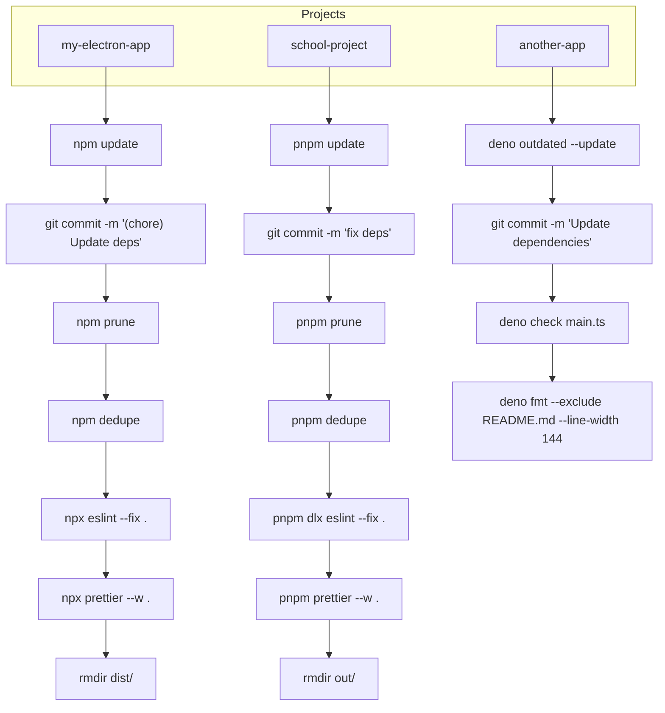
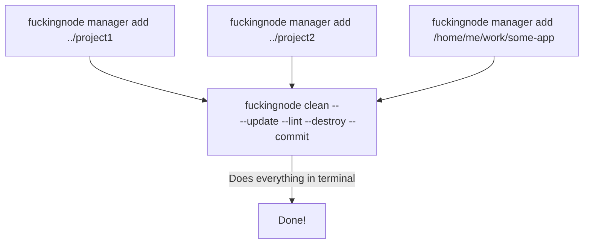
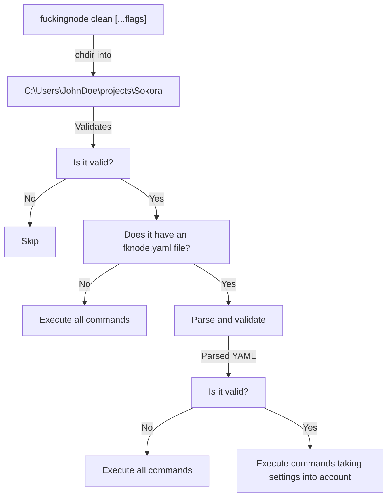

# Clean

The core of F\*ckingNode, a CLI that automates not just cleaning but overall maintenance of a NodeJS project.

## Abstract

As we said, the `clean` command is an automation feature. It doesn't really do anything _on it's own_, it simply gets all of your projects and recursively executes a bunch of CLI commands that are already installed on your system (`npm prune`, `npm dedupe`, `npx eslint --fix .`, etc...).

It might seem simple, but when you do the math, it becomes clearly visible how useful it is to have a tool that automates a process otherwise too messy.



This workflow can be simplified into the following:



We reduce your workflow to a one-time bunch of commands for initial setup, and then a single CLI command for each time you need to take care of any of these tasks, **recursively running each CLI command required per-project.**

### TL;DR

`fuckingnode clean` gets into each project's root directory and executes all the maintenance commands you need, automatically.

## How it works

### Finding your projects

You need to manually add a project, via the `fuckingnode manager add` command. When you add a project, it's stored in either:

- `C:\Users\YOUR_USER\AppData\Roaming\FuckingNode\` on :fontawesome-brands-windows: Windows
- `/home/.config/FuckingNode/` on :simple-apple: macOS and :simple-linux: Linux

Concretely, a plain `.txt` file called `fuckingnode-motherfuckers.txt` is used to store the absolute path to each project.

For example:

```txt title="fuckingnode-motherfuckers.txt" linenums="1"
C:\Users\JohnDoe\projects\Sokora
C:\Users\JohnDoe\projects\Vuelto
C:\Users\JohnDoe\projects\another-project-ig
```

Whenever you run the `fuckingnode clean` command, first thing we do is reading this file.

### Cleaning a project

Cleaning a project involves the following steps:



Inside the terminal you're running `fuckingnode` from, we'll change directories to each added project's path. From the inside, we proceed as follows:

First, we basically do some basic validations before touching each project (is the lockfile present? are node modules installed? etc...), so we know what to do and we're sure all commands will work out of the box. Some validations, like the absence of `node_modules`, will result in that project being skipped into the next one. Other validations, like a `deno.lock` lockfile, will change our behavior (in this example, we'd skip some features as Deno doesn't support all cleaning features, [as noted here](../manual/cross-runtime.md)).

Then, we seek a `fknode.yaml` config file - if present, we parse it and validate it. If not present, or invalid, **we run each CLI command from the open terminal**. When using `fuckingnode clean` you'll notice we don't add a loader whatsoever, but instead show you the raw output of each command as if you executed it yourself. That's because we did the same, each command is ran from the terminal you're on.

If settings _are_ present, we take them into account before doing anything, so if you added a `divineProtection` value we skip certain actions.

This process is executed recursively across all of your projects, until we're done. When no more projects are pending cleanup, we'll return to the original directory you executed the command from and exit with code `0`.

---

## Summary

We basically run the CLI commands you'd run by yourself recursively across all of your projects, saving you a lot of time.

---

## Availability

Where `EXP` indicates experimental, `CAVEAT` indicates partial support / support with known flaws, and `YES` and `NO` indicate the obvious.

| Support | NodeJS npm | NodeJS pnpm | NodeJS yarn | Deno | Bun |
| :-- | -- | -- | -- | -- | -- |
| **v2.0.0** | YES | YES | YES | CAVEAT | CAVEAT |
| v1.0.0 | YES | YES | YES | NO | NO |

To learn more about cross-runtime compatibility, [refer to this page](../manual/cross-runtime.md).
