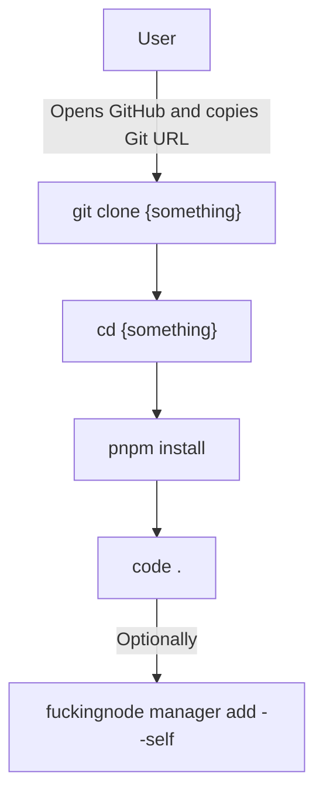

# Kickstart

An extra utility that automates cloning a NodeJS / Deno / Bun project from a Git repository and getting it up and running.

## Abstract

You might already be familiar with the problem we tried to solve originally - maintaining a NodeJS project implies a lot of CLI commands. Well, turns out cloning a project also implies a bunch of steps.

For a VSCode user that wants to clone a simple NodeJS project, it takes 4 CLI commands (3 assuming they'll waste more time by clicking the UI icon). 5 commands if they also add the project to F\*ckingNode's project list.

We built the `kickstart` command to reduce your cloning workflow to a single CLI command that auto-runs everything needed.

### TL;DR

`fuckingnode kickstart` clones a repo, installs dependencies, opens your preferred code editor, and adds the project to the F\*ckingNode project list.

## How it works

### Arguments

The `fuckingnode kickstart` commands takes one mandatory and two optional arguments: the Git URL, the clone path, and the package manager to be used, respectively.

First one is obvious, second one overrides the default location the repo will be cloned into (which defaults to creating a folder inside of the CWD with the name of the repository), and the third one chooses a package manager to be used. By default we use the package manager associated to the project you're cloning (if cloned repo has a `pnpm-lock.yaml` file, we'll auto-clone with `pnpm`). If a package manager is provided, we'll use that instead (it only accepts `npm`, `pnpm`, or `yarn` as values. You can't really _choose_ a package manager in Deno and Bun projects, where this argument is ignored).

### Process

It's really simple, we'll execute all commands in order - git clone, then the install command, and then we'll launch your favorite editor (defined from the [settings](../manual/configure.md#settings)). The project will be added _directly_ to the project list _instead of_ running the _actual_ CLI command (to avoid some issues that would occur with non-NodeJS projects).

If everything went alright, we'll exit with code `0`.

---

## Summary

We basically run the CLI commands you'd run by yourself in order to clone and get started a project, saving you time.

---

## Availability

This feature has been released and is available since `v2.0.0`. It's fully available everywhere. _No table as it's not runtime dependant._
