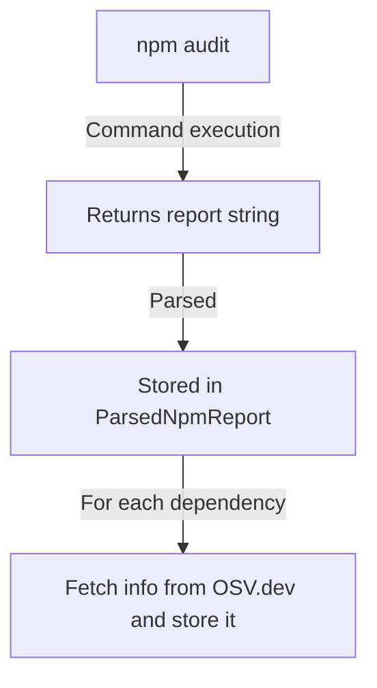
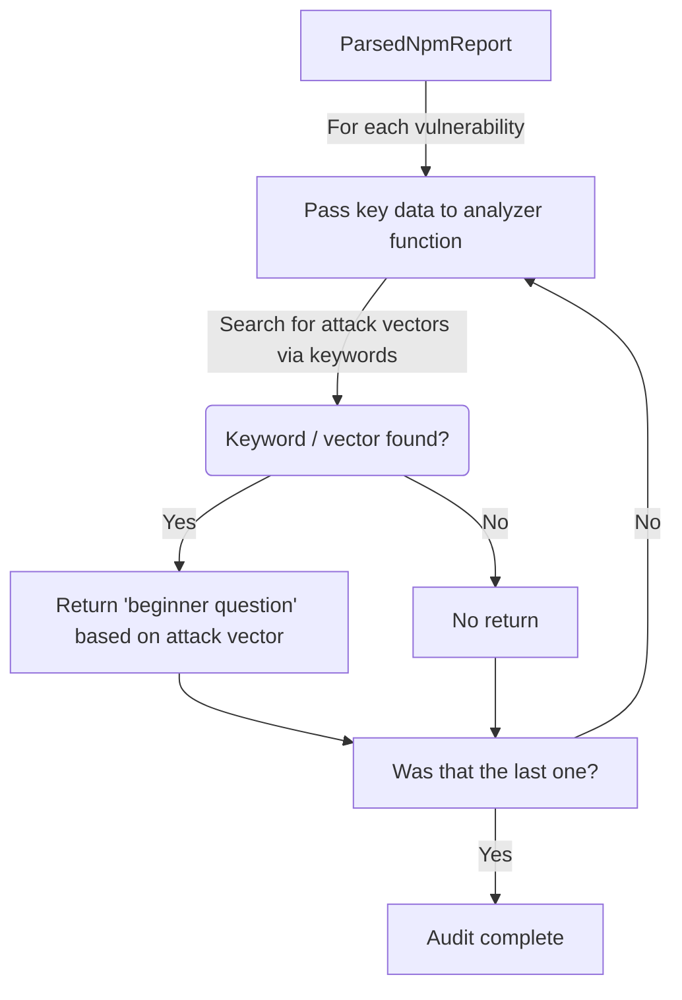
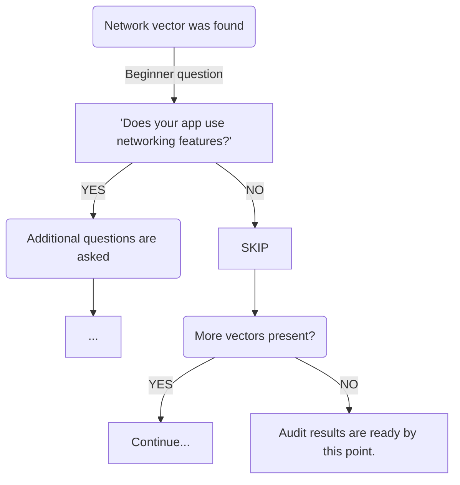

# Audit

An attempt to make security reports easier.

!!! danger "Unreleased feature"
    This is an unreleased feature (scheduled for `v2.1.0` as outlined in our [ROADMAP](../about/roadmap.md)). It's subject to changes, full rewrites, or even cancellations.
    [See the GitHub `feature-audit` branch for the source code of this feature.](https://github.com/ZakaHaceCosas/FuckingNode/compare/master...feature-audit)

## Abstract

I'll give you a real life example - I, the guy who's documenting this, have got other projects besides F\*ckingNode, including a mobile React Native app, which recently became affected by a `low` severity vulnerability, which related to cookies. The thing is, fixing that implied breaking changes (as `expo-router` had a dependency that had a dependency that had a... until one that depended on the vulnerable version).

However, as a mobile app that never interacted with cookies and very rarely used HTTP or the web themselves, turns out the breaking changes _aren't "worth it"_.

**Sometimes that's the case, a vulnerability isn't really a concern.** However, it can be hard to analyze if you really should just let it go, or if it's a vuln. that can really hurt your project. _**That's what we made this feature for.**_

### TL;DR

`fuckingnode audit` analyzes vulnerabilities and helps you tell if they really affect your project or if they can be left alone without too much risk.

## How it works

> AGAIN, THIS IS AN UNFINISHED, NON-RELEASED FEATURE.

The process is as follows:

- We analyze your vulnerabilities
- A questionnaire is made based on present attack vectors
- Your responses are used to prompt additional questions depending on your responses
- A final **risk factor** (percentage) is calculated and shown to you.

Due to where nowadays society is heading, it _is_ worth noting questions are not AI generated whatsoever.

### Step one: analysis



We regularly audit your project and rely on `https://api.osv.dev` to get more details onto what is it about. After that, a more detailed analysis is made where we obtain **key questions** based on vectors.



We search for keywords like `network`, `cookie`, or `console` which define "attack vectors". For each vector that's present, we return a "beginner question" for the auditing process. These "beginner questions" are the entry point of each vector's auditing flow - in other words - if the `network` vector _is_ found you'll be first asked if your app does make usage of any kind of networking features, asking you more specific questions about your usage if you respond "yes", or skipping the vulnerability if otherwise, considering it's probably a vulnerable dependency _of a dependency of a dependency..._ that does not really affect you.

### Step two: interrogation

As noted above, we will "interrogate" your usage of features. It's a simple YES/NO flow, like in this illustrated example:



### Step three: evaluation

Your questions are evaluated using a straightforward positive-negative system: responses indicating 'positive' information add +1 to the positive count, while those indicating 'negative' information add +1 to the negative count.

These counts are used to compute the RF, based on the following formula:

```typescript
(positives / (positives + negatives)) * 100
```

There's a `--strict` flag that can be passed to the audit command that adds an additional **risk bump**, based on the severity of the most-severe identified vulnerability, as follows:

```typescript
(RF + (RB * 100)) / 2
// RF = Risk Factor
// RB = Risk Bump
```

RB values are as follows:

| Severity | RB |
| :---- | ----: |
| critical | 1 |
| high | 0.75 |
| moderate | 0.5 |
| low | 0.25 |

---

## Summary

F\*ckingNode audit should not be allowed to have the final say over whether breaking-changes-packed security fixes should be applied or not. It is only meant to provide an estimate, in order to help you make a clearer decision. We will still always encourage you to resolve any vulnerability that you're capable of.

---

### Availability

This feature has not been released yet and is not available.

For trying it out, clone our repository including the `feature-audit` branch, `git checkout feature-audit` and execute `deno -A src/main.ts audit`.

*[RF]: Risk Factor; a percentage computed by us to estimate the joint impact of all vulnerabilities of a NodeJS project.
*[RB]: Risk Bump; a 0.25-1 number that's used to bump the RF based on the highest severity (as in low/moderate/high/critical) of a found vulnerability within a project.
