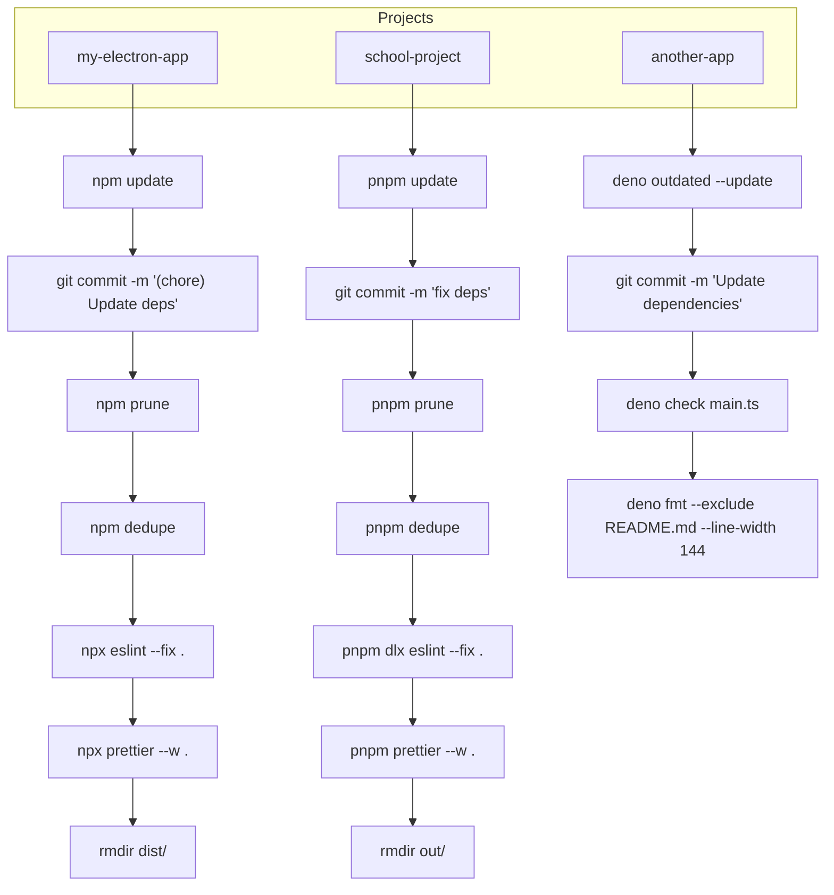
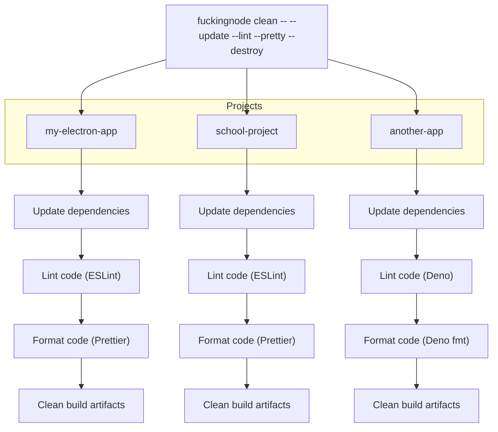

# Clean

The core of F\*ckingNode, a CLI that automates not just cleaning but overall maintenance of a NodeJS project.

## Abstract

As we said, the `clean` command is an automation feature. It doesn't really do anything _on it's own_, it simply gets all of your projects and recursively executes a bunch of CLI commands that are already installed on your system (`npm prune`, `npm dedupe`, `npx eslint --fix .`, etc...).

It might seem simple, but when you do the math, it becomes clearly visible how useful it is to have a tool that automates a process otherwise too messy.

This workflow can be simplified into the following:

We reduce your workflow to a one-time bunch of commands for initial setup, and then a single CLI command for each time you need to take care of any of these tasks, **recursively running each CLI command required per-project.**

### TL;DR

`fuckingnode clean` gets into each project's root directory and executes all the maintenance commands you need, automatically.

## How it works

-- TODO
