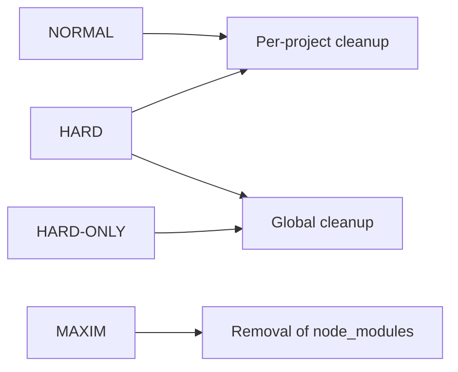

<!-- markdownlint-disable md010 md046 md033 -->
# Using F\*ckingNode: cleanup

The core idea of F\*ckingNode is to automate cleanup of your NodeJS projects. On top of that base, additional maintenance features and [cross-runtime support](cross-runtime.md) exist as well.

## The `clean` command

The `fuckingnode clean` command is the base utility of the app. It accepts the following (all optional) arguments:

```bash
fuckingnode clean < INTENSITY > [--update] [--lint] [--pretty] [--destroy] [--verbose] [--commit]
```

When executed with no arguments, it'll do a cleanup using the default intensity (which is `normal` and can be changed from the [settings](settings.md)).

## Cleaner intensities, explained

There are four (well, three in reality) intensities available:

- `normal`
- `hard`
- `maxim`

and an additional `hard-only` level.

This graph demonstrates what does each level do.



The `normal` level recursively "cleans" each of your project. We define "cleaning" by automatically running all the features your package manager provides for this task (you might not even know about commands like `npm dedupe`, right?).

The `hard` level does the previous (unless using `hard-only`), plus cleans global caches. This will make the most sense for `pnpm` user, which is known for it's global module cache, however cleaning is made for all package managers.

!!! warning
    As `npm` itself warns you when cache cleaning manually, it will make `npm` even slower than what it already is next time you use it.
    Our recommendation is simple: to use `pnpm` as your default package manager. Don't remove `npm`, though, as compatibility issues may appear.

We recommend running `normal` cleanups in a mid-frequent basis, and `hard` cleanups two or three times a month. That's our recommendation, of course. Do whatever you please with your PC.

The `maxim` level does not execute any of the above, it simply removes `node_modules` from every single project you've added (forcing you to reinstall dependencies next time you use them). For average use, it is discouraged.

However, in some cases, it can be useful, as our registered record is of **11 recovered gigabytes storage after using this cleanup** (yes, eleven). So, for example, if you needed to download a particularly big file and completely forgot your drive is almost full, this command will free up a particularly big chunk of your hard drive.

---

Now that we know this, we can choose whatever fits our needs each time we run a cleanup

```bash
fuckingnode clean normal
fuckingnode clean hard
fuckingnode clean hard-only
fuckingnode clean maxim
```

Running without an intensity will use the **default intensity**. On a fresh install, it's always `normal`, however [that can be changed to your linking from the settings command](settings.md).

## Configuring a project's behavior

Before advancing into the additional feature section, something you should know about is `fknode.yaml`. It's a simple config file, similar to what you're used to (`.prettierrc`, `.eslintrc.js`...) that lives in the root of the repo.

It's completely opt-in and not required whatsoever. However, it can be really useful (and some additional features do require specific configuration from this file).

Instead of a boring reference-like explanation here, we got a fully documented, easy to follow file example at our repository. [Click here to go over there.](https://github.com/ZakaHaceCosas/FuckingNode/blob/master/fknode.example.yaml)

## Using additional features

By default, `fuckingnode clean (intensity)` only performs a cleanup of the desired level. Features we promised you (automated updating, linting, prettifying, destroying, and committing) are opt-in features.

Simply pass them as a flag to use them. No args are required for any of them.

```bash
fuckingnode clean -- --update --lint --pretty --destroy --commit
```

Available flags are:

| Flag | Why does this exist |
| :--- | ---: |
| `--lint` | does the obvious (lints)|
| `--pretty` | does the obvious (prettifies)|
| `--destroy`| does the obvious (destroys*) |
| `--commit`| does the obvious (commits)|
| `--update` | does the obvious (updates)|

\* if not obvious enough, removes files and directories you specify, such as `.react`, `out/`, `dist/`, or anything you'd like to do away with.

!!! abstract "Cross-runtime support notice"

    Advanced features might not work everywhere. See [cross-runtime support](../manual/cross-runtime.md) for more info.

Some of these features depend on `fknode.yaml` configuration, [as noted above](#configuring-a-projects-behavior).

### Callouts

!!! info "About errors"

    Any error from additional tasks will fail silently; this means they won't stop the execution flow and no logs will be made. However, since the CLI shows command output live, errors will likely be shown in there.

### Linting your code: `--lint`

When linting, we will automatically run your linter. By default, we use ESLint - which in most cases should just work out of the box. Still, for convenience, you're able to choose a different linter.

More precisely, `--lint` runs `eslint --fix .` on each of your projects, unless overridden.

To override it, create a script in your `package.json` scripts object that runs your preferred linter, then copy the name of the script and paste it as the value for the `lintCmd` key on your `fknode.yaml`.

For example:

```jsonc title="package.json" linenums="6"
scripts: {
    "linter": "someLinter --fix --force ." // or whatever
}
```

```yaml title="fknode.yaml" linenums="1"
lintCmd: "linter"
```

### Prettifying your code: `--pretty`

When prettying, we will automatically run your prettifier. By default, we use Prettier - which just as ESLint should work, and just as ESLint can be changed anyway.

More precisely, `--pretty` runs `prettier --w .` on each of your projects, unless overridden.

To override it, do the same as with the linter but setting the `prettyCmd` key instead.

For example:

```jsonc title="package.json" linenums="6"
scripts: {
    "prettifier": "not-prettier --trailing-coma --line-width 120 --force ." // or whatever
}
```

```yaml title="fknode.yaml" linenums="2"
prettyCmd: "prettifier"
```

### Destroying your <s>code</s> files: `--destroy`

When destroying, we will automatically remove files and directories you specified.

You already know what command this will run (your operating system's default file removal command).

!!! abstract "Don't forget!"

    `fknode.yaml` allows (and requires) you to specify on which intensities you'd like this to run (so for example, one project will always `destroy` upon cleanup, and other project will only `destroy` upon a `hard` cleanup). Other commands do not currently support specifying per intensity level usage rules.

To configure it, add a `destroy` key to the `fknode.yaml` with two sub-items: an array called `intensities`, and a list called `targets`, to specify paths to files to be deleted **relative to the root of the project** (or absolute if you will).

For example:

```yaml title="fknode.yaml" linenums="3"
destroy:
    intensities: [
        "hard",
        "maxim",
    ]
    targets:
        - "out"
        - "cache"
        - ".react"
        - ".whateverFramework"
        - "node_modules" # please don't do that
```

You can use an asterisk (`*`) if you want to destroy with all intensities without typing all of that. _Due to how the CLI is designed, it must still be an array, so `["*"]` works and `"*"` doesn't._

### Committing your code: `--commit`

When committing, we will automatically commit our changes (updating, linting, prettifying) to Git, using a default commit message unless overridden.

`commit` will be executed directly, without changing branches whatsoever.

For your own safety, we will commit ONLY IF ALL of the following conditions are TRUE:

- There were no uncommitted changes _BEFORE_ we touched your projects.
- There are no changes from upstream that haven't been pulled.
- You EXPLICITLY allowed committing for that project in the `fknode.yaml` file.

!!! success "Safety first."
    While features you opt-in when cleaning are automatically used on **all** projects as noted above, an exception was made for committing, requiring explicit allowance for your own safety.

    To allow a project's code to be committed, add the following to your `fknode.yaml`:

    ```yaml title="fknode.yaml" linenums="14"
    commitActions: true # authorize commits
    ```

### Updating your code: `--update`

When updating, we will automatically update your dependencies using your project's package manager (we'll know that based on your lockfile). By default, the standard update command is used, though you can actually override this command too.

> Personally, I didn't think that was useful until I found out (the bad way) why `expo` "reinvented the wheel" with `expo install --check` and encouraged users to use that instead of `npm update` - I had to reinstall everything like four times to get the project to compile again. So yeah, in some cases you do need to use a specific command for dependencies, and we got you covered.

Unless overridden, you already know what command this will run (`npm update` or `pnpm update` or whatever you use).

To override it, do the same as with the linter and prettifier, but setting the `updateCmdOverride` key instead. The name is slightly more verbose, as while as I told you sometimes you might need this, in most cases it could even be a bad idea to override the update command.

```yaml title="fknode.yaml" linenums="15"
updateCmdOverride: "update"
```

---

TODO
