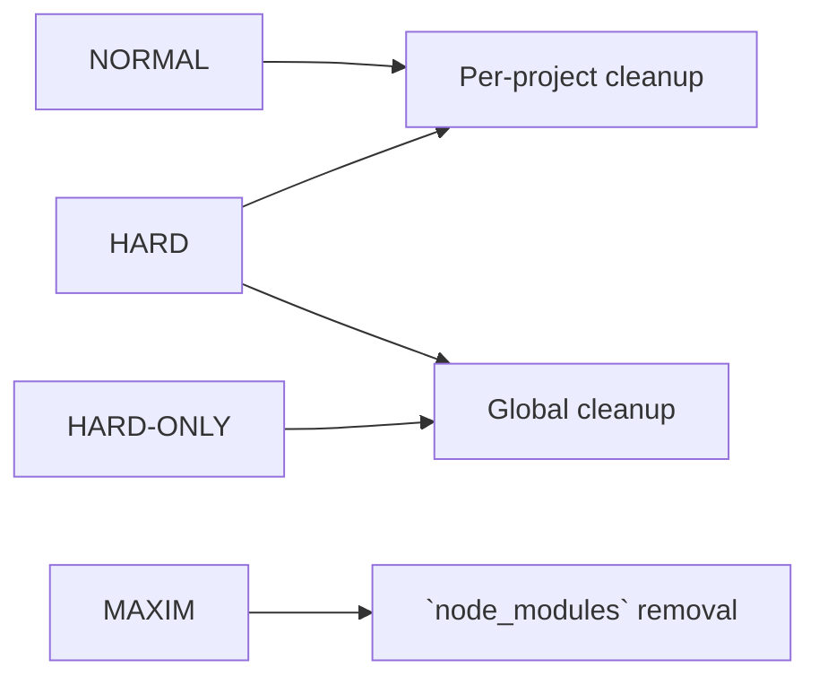

<!-- markdownlint-disable md010 -->
# Using F\*ckingNode: cleanup

The core idea of F\*ckingNode is to automate cleanup of your NodeJS projects. On top of that base, additional maintenance features and [cross-runtime support](cross-runtime.md) exist as well.

## The `clean` command

The `fuckingnode clean` command is the base utility of the app. It accepts the following (all optional) arguments:

```bash
fuckingnode clean < INTENSITY > [--update] [--lint] [--pretty] [--destroy] [--verbose] [--commit]
```

When executed with no arguments, it'll do a cleanup using the default intensity (which is `normal` and can be changed from the [settings](settings.md)).

## Cleaner intensities, explained

There are four (well, three in reality) intensities available:

- `normal`
- `hard`
- `maxim`

and an additional `hard-only` level.

This graph demonstrates what does each level do.



The `normal` level recursively "cleans" each of your project. We define "cleaning" by automatically running all the features your package manager provides for this task (you might not even know about commands like `npm dedupe`, right?).

The `hard` level does the previous (unless using `hard-only`), plus cleans global caches. This will make the most sense for `pnpm` user, which is known for it's global module cache, however cleaning is made for all package managers.

!!! warning
    As `npm` itself warns you when cache cleaning manually, it will make `npm` even slower than what it already is next time you use it.
    Our recommendation is simple: to use `pnpm` as your default package manager. Don't remove `npm`, though, as compatibility issues may appear.

We recommend running `normal` cleanups in a mid-frequent basis, and `hard` cleanups two or three times a month. That's our recommendation, of course. Do whatever you please with your PC.

The `maxim` level does not execute any of the above, it simply removes `node_modules` from every single project you've added (forcing you to reinstall dependencies next time you use them). For average use, it is discouraged.

However, in some cases, it can be useful, as our registered record is of **11 recovered gigabytes storage after using this cleanup** (yes, eleven). So, for example, if you needed to download a particularly big file and completely forgot your drive is almost full, this command will free up a particularly big chunk of your hard drive.
